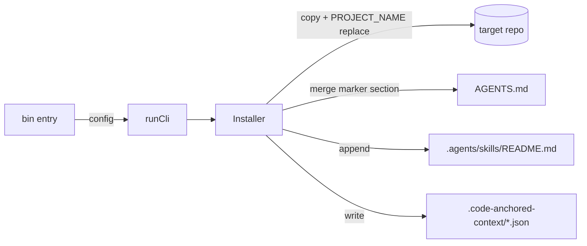

# Architecture

## Context

The repository is an npm workspaces monorepo. The root is private and not
published. Each package under `packages/` is published independently and is
self-contained: it carries its own installer, its template payload, and its
tests.

## Layout

```text
/ (umbrella root, private)
  README.md            umbrella overview + links to writing/
  writing/             shared narrative; excluded from both npm packages
  context/             this repo's own working bench (dogfood)
  decisions/           this repo's own durable decision log (dogfood)
  packages/
    planning/
      bin/ lib/ template/ tests/ package.json
    reference/
      bin/ lib/ template/ tests/ package.json
```

## Installer

Both packages share the same generic installer, copied into each package's
`lib/installer.js` and driven by a `config` object supplied by the package's
`bin/` entry point.



The `config` carries: `cliName`, `packageRoot`, `packageJson`, `summaryLabel`,
`metadataPath`, the `skills` list, and the `agents` marker section renderer.

## Coexistence In One Repo

A repo may install both packages. They do not collide because:

- AGENTS.md uses distinct marker pairs:
  `code-anchored-context:planning:*` and `code-anchored-context:reference:*`.
- Skills are copied per-skill into `.agents/skills/<name>/`, and the skills
  `README.md` is appended, not overwritten.
- Each package writes its own metadata file:
  `.code-anchored-context/planning.json` and `.code-anchored-context/reference.json`.

## Boundaries

- The planning package never writes `reference/`.
- The reference package never requires `context/`; it can optionally read
  `release-doc-notes.md` when present.
