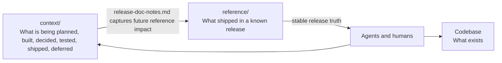

# Code-Anchored Context: Giving Coding Agents The Context Around The Code

The companion article,
[Code-Anchored Context: The Rationale](code-anchored-context-rationale.md), laid
out the painpoints — reasoning lost to closed sessions, plans that cannot be
shared, documentation that drifts. This article is the principle that resolves
them.

Coding agents are good at reading repositories, editing files, and following
instructions. But in large codebases, code is not the whole story.

The hard part is not whether an agent can change a file. It is whether it
understands the intent behind the change, the current release scope, the
decisions already made, the work deliberately deferred, how the change should
be verified, how it ships, and what infrastructure or operational risks
surround it.

That context usually exists — in chats, tickets, pull request comments,
planning notes, and people's heads — but agents need it in a structured,
discoverable form.

## Reference vs Working Context

This is why I separate **released reference** from **working
context**:

```text
reference/   What shipped.
context/      What we are planning, building, deciding, testing,
                  shipping, hosting, deferring, and learning.
```

Reference stays stable and release-accurate: it describes a known
release, not an unfinished branch. Working context is allowed to evolve —
it is where humans and agents work through ambiguity.

Be aware that this means `context/` *drifts by design*. It is working-time
scaffolding, not the source of truth. The durable conclusions are folded back
into `reference/` when a release is accepted, so reference is eventually
consistent with shipped code while `context/` is free to move on. For how that
sync actually happens, see the companion article,
[Code-Anchored Context: Keeping Reference In Sync](code-anchored-context-reference-sync.md).

## The Principle

I think of this as **Code-Anchored Context**. Not a methodology — a rule of
thumb:

> Keep truth as close to code as possible, and keep the surrounding context
> structured enough that both humans and agents can find it.

It is opinionated on purpose: prefer repository-local context, explicit
lifetimes, and navigable structure over scattered notes that only make sense
to the people who were in the room. Repository-local context scales beyond one
person.

## Who This Is For

This assumes a harness-engineering model: an engineer working *through* an
agent and staying accountable for the result, not a fully autonomous agent
documenting itself unsupervised. The structure pays off because a human plans,
reviews, and implements deliberately — often across separate sessions — rather
than asking one session to do everything at once.

That separation also dissolves the obvious objection that all this context will
crowd the agent's context window. It only competes if you do everything in one
go. When planning happens in one session, review in another, and implementation
in a third that refers back to the settled plan, each session carries only what
it needs. For the cases where this model is the wrong fit, see the companion
article,
[Code-Anchored Context: Limitations](code-anchored-context-limitations.md).

## Where It Shines

The value compounds with how code-first your repository already is. The more of
your system that lives as code and CLI-driven tooling — infrastructure as code,
CI/CD as code, end-to-end suites like Playwright, integration and unit tests,
deployment and operational scripts — the more an agent can take in at once.

That breadth is what changes the agent's behavior. When the surrounding system
is visible as code, the agent is forced to look at the big picture: it can judge
whether a change is trivial or massive, reason about the overall impact across
boundaries it would otherwise never see, and propose alternatives instead of
just executing the first path that works. Context is the difference between an
agent that edits a file and one that understands the blast radius of the edit.

This is why the approach spans the whole arc — from planning to observability
and everything in between. Each code-first surface you add is one more place the
agent inherits context for free, and one less place where it has to guess.

## Why It Travels

When context is materialized in the repository, it stops being tied to one
chat transcript, IDE, agent, or session. A team can switch tools without
losing the trail of why the system is shaped the way it is. The next human or
agent opens the repo and continues from the same accumulated understanding
instead of reconstructing it from memory.



## A Deliberate Bundle

None of the individual pieces here are novel, and that is intentional.
Architecture decision records, docs-as-code, monorepo context conventions, and
spec-driven development each already solve part of the problem. Code-Anchored
Context does not try to replace them — it composes them around one organizing
idea: a clear split between release-anchored `reference/` truth and evolving
`context/` work, made navigable for both humans and agents.

The contribution is the bundle and the lifetimes, not a new primitive. If you
already practice ADRs and docs-as-code, you are most of the way here; this gives
those habits a shared home and an explicit boundary between what shipped and
what is still being figured out.

## Why It Matters

Code-Anchored Context is context continuity. It helps agents and humans answer:

- What is active now, and what belongs to a future phase?
- What was cut from scope, and why was a decision made?
- How should this be tested, and what gates must pass before release?
- How will it ship, and what infrastructure does it depend on?
- What should become reference later?
- What reasoning needs to survive a change of IDE, agent, or session?

Code tells an agent *what exists*. Working context tells it *why* it
exists, where it is going, what has been decided, and what was left for later.

For the concrete folder layout, see the companion article,
[Code-Anchored Context: The Structure](code-anchored-context-structure.md).
